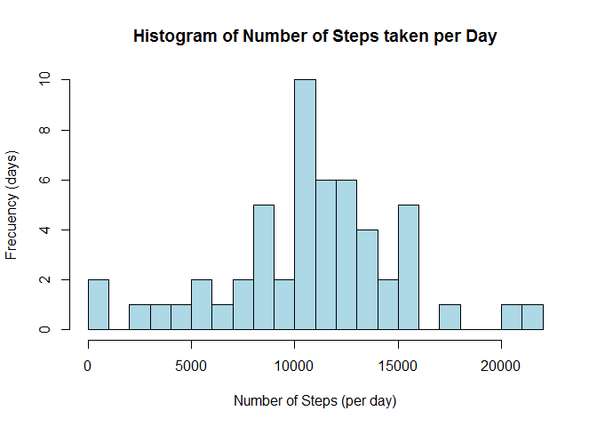
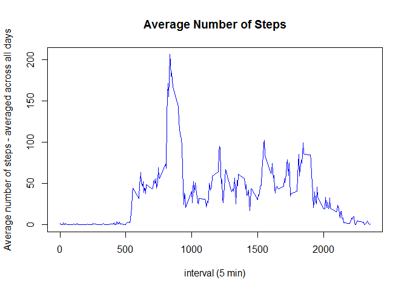
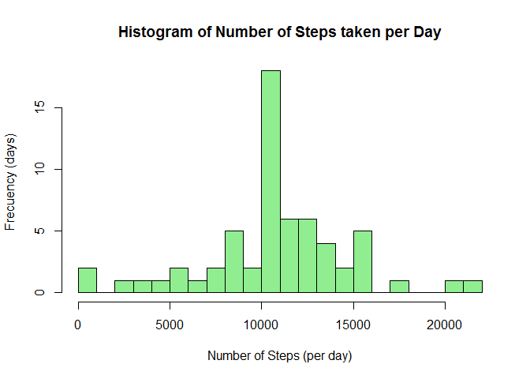
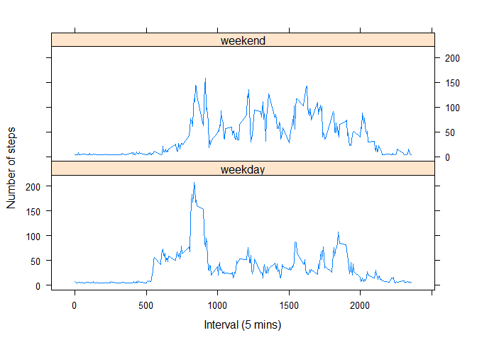

# Reproducible Research: Peer Assessment 1
Roberto Obando  
## Introduction
This report explains the analysis, design and implementation of the Reproducible Research: Peer Assessment 1 assignment. The objective is to answer a series of questions based on data from a personal activity monitoring device such as a Fitbit, Nike Fuelband, or Jawbone Up. The device collects data at 5 minute intervals through out the day. The data consists of two months of data from an anonymous individual collected during the months of October and November, 2012 and include the number of steps taken in 5 minute intervals each day.
We will use the template given in the assignment to write up the report.  

## Q1 Loading and preprocessing the data  
Assumption: Data in zip format exists in the current working directory  

#### 1. Load the Data  


```r
activityData<- unzip("./activity.zip")

# reading csv file
activityData <- read.csv(file="./activity.csv",)
str(activityData)
```

```
## 'data.frame':	17568 obs. of  3 variables:
##  $ steps   : int  NA NA NA NA NA NA NA NA NA NA ...
##  $ date    : Factor w/ 61 levels "2012-10-01","2012-10-02",..: 1 1 1 1 1 1 1 1 1 1 ...
##  $ interval: int  0 5 10 15 20 25 30 35 40 45 ...
```

#### 2. Setting columns format appropriatelly  


```r
activityData$date <- as.Date(activityData$date)
activityData$steps <- as.numeric(activityData$steps)
```

After inspecting the dataset I found it has 3 columns: steps, date, and interval. The meaning of this columns is:  
* steps    - Number of steps taking in a 5-minute interval (missing values are coded as NA)  
* date     - The date on which the measurement was taken in YYYY-MM-DD format  
* interval - Identifier for the 5-minute interval in which measurement was taken  

## Q2 What is mean total number of steps taken per day?

#### 1. Make a histogram of the total number of steps taken each day


```r
#Find the number of steps per day
numberStepsPerDay <- aggregate(activityData$steps ~ activityData$date, activityData, sum)

# renaming numberStepsPerDay columns
colnames(numberStepsPerDay) <- c("date", "steps")

## Make a histogram of the total number of steps taken each day
hist(numberStepsPerDay$steps,
     breaks = 30,
     main = paste("Histogram of Number of Steps taken per Day"), 
     col="lightblue", xlab="Number of Steps (per day)", ylab="Frecuency (days)")
```

 

#### 2. Calculate and report the mean and median total number of steps taken per day


```r
meanSteps <- mean(numberStepsPerDay$steps)
meanSteps
```

```
## [1] 10766.19
```

```r
medianSteps <- median(numberStepsPerDay$steps)
medianSteps
```

```
## [1] 10765
```

## Q3 What is the average daily activity pattern?

#### 1. Make a time series plot (i.e. type = "l") of the 5-minute interval (x-axis) and the average number of steps taken, averaged across all days (y-axis)

I am using the aggregate function to get the average of the number of steps taken. Then we plot  using 'plot' function with type = '1' 


```r
stepsInterval <- aggregate(steps ~ interval, data=activityData, FUN=mean)
plot(stepsInterval, 
     type="l",
     col="blue",
     xlab="interval (5 min)", 
    ylab="Average number of steps - averaged across all days",
    main="Average Number of Steps")
```

 

#### 2. Which 5-minute interval, on average across all the days in the dataset contains the maximum number of steps?


```r
maxStepsInterval <- stepsInterval$interval[which.max(stepsInterval$steps)]
maxStepsInterval
```

```
## [1] 835
```


## Q4 Imputing missing values

#### 1. Calculate and report the total number of missing values in the dataset (i.e. the total number of rows with NAs)

The data frame square bracket operator in combination with 'is.na' is used to subset the rows with 'NA' values. We are sub setting across the entire dataset, not the steps column only. In this case the results would be the same as if I do this for the steps column only, since the other columns don't have 'NA' values.


```r
activityDataNoNA <- activityData[rowSums(is.na(activityData)) > 0,]
nrow(activityDataNoNA)
```

```
## [1] 2304
```

#### 2. Devise a strategy for filling in all of the missing values in the dataset. The strategy does not need to be sophisticated. For example, you could use the mean/median for that day, or the mean for that 5-minute interval, etc.
The simplest strategy uses the mean for that day to replace the 'NA' values. The introduction of this data won't interfere with the results, since we are using average values to replace missing data. 

#### 3. Create a new dataset that is equal to the original dataset but with the missing data filled in.


```r
newActivityData <- activityData
newActivityData$steps[is.na(newActivityData$steps)] = mean(newActivityData$steps, na.rm=TRUE)
str(newActivityData)
```

```
## 'data.frame':	17568 obs. of  3 variables:
##  $ steps   : num  37.4 37.4 37.4 37.4 37.4 ...
##  $ date    : Date, format: "2012-10-01" "2012-10-01" ...
##  $ interval: int  0 5 10 15 20 25 30 35 40 45 ...
```

#### 4. Make a histogram of the total number of steps taken each day and Calculate and report the mean and median total number of steps taken per day. Do these values differ from the estimates from the first part of the assignment? What is the impact of imputing missing data on the estimates of the total daily number of steps?


Performing the same process from question 2, but this time using the new data set with the missing values replaced with the mean for that day.


```r
#Find the number of steps per day
newNumberStepsPerDay <- aggregate(newActivityData$steps ~ newActivityData$date, newActivityData, sum)
# renaming numberStepsPerDay columns
colnames(newNumberStepsPerDay) <- c("interval", "steps")

## Make a histogram of the total number of steps taken each day
hist(newNumberStepsPerDay$steps,
     breaks = 30,
     main = paste("Histogram of Number of Steps taken per Day"), 
     col="lightgreen", xlab="Number of Steps (per day)", ylab="Frecuency (days)")
```

 

```r
# and Calculate and report the mean and median total number of steps taken per day. 
newMeanSteps <- mean(newNumberStepsPerDay$steps)
newMeanSteps
```

```
## [1] 10766.19
```

```r
newMedianSteps <- median(newNumberStepsPerDay$steps)
newMedianSteps
```

```
## [1] 10766.19
```

These values are similar to the results from Q2. 
In this case the impact is minimal since the missing data is replaced with averages of their respective days.  
Note: I had used the median instead of mean to fill the missing values:  
(newActivityData$steps[is.na(newActivityData$steps)] = median(newActivityData$steps, na.rm=TRUE)),  
but the rendered values are considerably different to the ones in Q2. The mean and median were: 9354.23 and 10395, so I preferred to use the mean.

## Q5 Are there differences in activity patterns between weekdays and weekends?

#### 1. Create a new factor variable in the dataset with two levels -- "weekday" and "weekend" indicating whether a given date is a weekday or weekend day.

Crete a new column (day) of type char, and then populate it using weekdays function applied to the date column.  
Next, transform the column type from char to factor with 2 levels: weekday and weekend.


```r
newActivityData$day <- ifelse(weekdays(newActivityData$date) == "Saturday" | weekdays(newActivityData$date) == "Sunday" ,"weekend","weekday")
newActivityData$day  <- as.factor(newActivityData$day)
str(newActivityData)
```

```
## 'data.frame':	17568 obs. of  4 variables:
##  $ steps   : num  37.4 37.4 37.4 37.4 37.4 ...
##  $ date    : Date, format: "2012-10-01" "2012-10-01" ...
##  $ interval: int  0 5 10 15 20 25 30 35 40 45 ...
##  $ day     : Factor w/ 2 levels "weekday","weekend": 1 1 1 1 1 1 1 1 1 1 ...
```

#### 2. Make a panel plot containing a time series plot (i.e. type = "l") of the 5-minute interval (x-axis) and the average number of steps taken, averaged across all weekday days or weekend days (y-axis).


```r
stepIntervalDayMean <- aggregate(newActivityData$steps, by = list(newActivityData$day, newActivityData$interval), mean, na.rm=TRUE)
colnames(stepIntervalDayMean) <- c("day", "interval", "stepsMean")
library("lattice")
xyplot(stepsMean ~ interval| day, 
       data = stepIntervalDayMean,
       type = "l",
       xlab = "Interval (5 mins)",
       ylab = "Number of steps",
       layout=c(1,2))
```

 

Yes,the activity patters are clearly different. The panel plots above, shows that the user of the device is more active during the weekends than the weekdays. 

